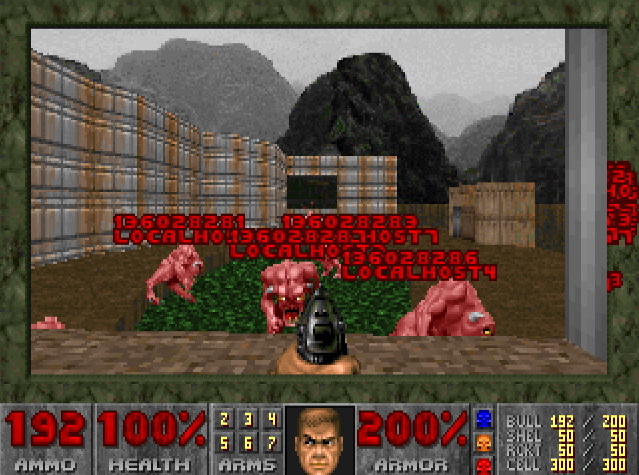

# 🔨 Ansible-DOOM

Entertaining Ansible chaos engineering—deploy Ansible configurations by killing DOOM enemies.

This project is a Python fork inspired by several projects:
- Based on [kubedoom](https://github.com/storax/kubedoom) (a Go project).
- Forked from [dockerdoom](https://github.com/gideonred/dockerdoom).
- Also heavily inspired by [terraform-doom](https://github.com/theobori/terraform-doom).



## ℹ️ Usage

This example uses an Ansible project from the `examples` folder. In this testing-only case, the inventory defines 10 Ansible hosts (all set to `localhost`), and the playbook simply pings each host.

At startup, enemy spawn points appear on an out-of-bounds area. You can view and access them using the **`idspispopd`** No-Clip cheat code.

The Ansible project directory must be mounted into the container at `/doomsible/conf`. Optionally, you can pass the environment variables `ANSIBLE_FILENAME` and `HOSTS_FILENAME` to specify custom file names. If not set, the defaults are:
- **ANSIBLE_FILENAME:** `ansible-playbook.yml`
- **HOSTS_FILENAME:** `hosts.ini`

### Running the Container

```bash
docker run \
    -itd \
    --rm=true \
    --name ansible-doom \
    -p 5900:5900 \
    -e ANSIBLE_FILENAME=playbook.yml \
    -e HOSTS_FILENAME=hosts.ini \
    -v $PWD/example:/doomsible/conf \
    ghcr.io/krokz/ansible-doom:latest
```

### Accessing the Game

Once the container is running, connect to the DOOM game via a VNC client. For example:

```bash
vncviewer viewer localhost:5900
```

The default VNC password is **`1234`**.

### Customizing the VNC Password

To change the VNC password, build the image yourself and pass the `VNC_PASSWORD` build argument:

```bash
docker buildx build . \
    -t ansible-doom \
    --build-arg VNC_PASSWORD=custom_password
```

## 🔎 Cheat Codes

In-game, you can use the following cheat codes:
- **`idkfa`**: Get a weapon on slot 5.
- **`idspispopd`**: No Clip (useful to reach the enemies).
