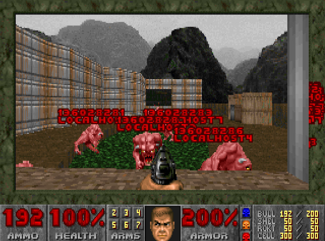

# 🔨 Ansible-DOOM

Entertaining Ansible chaos engineering—deploy Ansible configurations by killing DOOM enemies.

Each enemy in the game represents a host from your Ansible inventory. Kill an enemy, and the corresponding Ansible playbook runs against that host.

This project is a Python fork inspired by several projects:
- Based on [kubedoom](https://github.com/storax/kubedoom) (a Go project).
- Forked from [dockerdoom](https://github.com/gideonred/dockerdoom).
- Also heavily inspired by [terraform-doom](https://github.com/theobori/terraform-doom).



## ℹ️ Usage

This example uses an Ansible project from the `example` folder. In this testing-only case, the inventory defines 10 Ansible hosts (all set to `localhost`), and the playbook simply pings each host.

At startup, enemy spawn points appear on an out-of-bounds area. You can view and access them using the **`idspispopd`** No-Clip cheat code.

The Ansible project directory must be mounted into the container at `/doomsible/conf`. Optionally, you can pass the environment variables `ANSIBLE_FILENAME` and `HOSTS_FILENAME` to specify custom file names. If not set, the defaults are:
- **ANSIBLE_FILENAME:** `ansible-playbook.yml`
- **HOSTS_FILENAME:** `hosts.ini`

### Running the Container

```bash
docker run \
    -itd \
    --rm=true \
    --name ansible-doom \
    -p 5900:5900 \
    -v $PWD/example:/doomsible/conf \
    ghcr.io/krokz/ansible-doom:latest
```

To use custom filenames for your playbook and inventory:

```bash
docker run \
    -itd \
    --rm=true \
    --name ansible-doom \
    -p 5900:5900 \
    -e ANSIBLE_FILENAME=my-playbook.yml \
    -e HOSTS_FILENAME=my-hosts.ini \
    -v $PWD/my-project:/doomsible/conf \
    ghcr.io/krokz/ansible-doom:latest
```

### Accessing the Game

Once the container is running, connect to the DOOM game via a VNC client. For example:

```bash
vncviewer localhost:5900
```

The default VNC password is **`1234`**.

### Customizing the VNC Password

To change the VNC password, build the image yourself and pass the `VNC_PASSWORD` build argument:

```bash
docker buildx build . \
    -t ansible-doom \
    --build-arg VNC_PASSWORD=custom_password
```

## 🔎 Cheat Codes

In-game, you can use the following cheat codes:
- **`idkfa`**: Get a weapon on slot 5.
- **`idspispopd`**: No Clip (useful to reach the enemies).

## 🏗️ Architecture

```
┌─────────────────────────────────────────────────────┐
│  Docker Container                                   │
│                                                     │
│  ┌──────────┐    ┌──────────┐    ┌───────────────┐  │
│  │  Xvfb    │    │ x11vnc   │◄───│  VNC Client   │  │
│  │ :99      │◄───│ :5900    │    │  (external)   │  │
│  └────┬─────┘    └──────────┘    └───────────────┘  │
│       │                                             │
│  ┌────▼─────────────────────┐                       │
│  │  psDooM (DOOM engine)    │                       │
│  │                          │                       │
│  │  Enemies = Ansible hosts │                       │
│  │  Kill enemy → triggers   │                       │
│  │  deployment via socket   │                       │
│  └────┬─────────────────────┘                       │
│       │  UNIX socket                                │
│       │  /dockerdoom.socket                         │
│  ┌────▼─────────────────────┐                       │
│  │  Python Socket Server    │                       │
│  │  (ansible_doom.py)       │                       │
│  │                          │                       │
│  │  list → read inventory   │                       │
│  │  kill → ansible-playbook │                       │
│  │  reload → clear state    │                       │
│  └────┬─────────────────────┘                       │
│       │                                             │
│  ┌────▼─────────────────────┐                       │
│  │  ansible-playbook        │                       │
│  │  -i <temp_inventory>     │                       │
│  │  --limit <hostname>      │                       │
│  └──────────────────────────┘                       │
│                                                     │
│  /doomsible/conf/ (mounted volume)                  │
│    ├── hosts.ini          (inventory)               │
│    └── ansible-playbook.yml (playbook)              │
└─────────────────────────────────────────────────────┘
```

**Flow:**
1. On startup, the Python server launches Xvfb, x11vnc, and psDooM as monitored subprocesses.
2. psDooM periodically sends `list` over the UNIX socket to get inventory hostnames.
3. Each hostname becomes an in-game enemy (demon).
4. When the player kills an enemy, psDooM sends `kill <hostname>` over the socket.
5. The Python server runs `ansible-playbook` against that specific host.

### Socket Protocol

The Python server listens on `/dockerdoom.socket` and accepts these line-oriented commands:

| Command | Response | Description |
|---------|----------|-------------|
| `list` | Newline-separated hostnames | Returns all hosts from the inventory file |
| `kill <hostname>` | *(none)* | Triggers an async `ansible-playbook` run targeting `<hostname>` |
| `reload` | `Deployed hosts cleared.\n` | Resets the deployment tracker so hosts can be targeted again |

## ⚠️ Security Notice

This project executes `ansible-playbook` against hosts defined in the mounted inventory with whatever playbook you provide. **Any code that can write to the mounted `/doomsible/conf` directory controls what Ansible executes.** This is intended for demos, education, and entertainment—not production use.

- Do not expose the VNC port to untrusted networks without additional authentication.
- Do not mount sensitive playbooks or inventories with real production hosts unless you understand the consequences.

## 🔧 What's Modified from Upstream

This project vendors [dockerdoom](https://github.com/gideonred/dockerdoom) (itself a fork of [psDooM](http://psdoom.sourceforge.net/)) under `dockerdoom/`. The key modifications are:

- **`dockerdoom/trunk/src/pr_process.c`** — Replaced `ps` process listing with `nc` calls to the UNIX socket (`list` and `kill` commands). The `hash()` function generates deterministic IDs for monster tracking.
- **`dockerdoom/trunk/src/p_inter.c`** — Updated `P_KillMobj()` to pass the hostname string (from `m_pname`) to `pr_kill()`.
- **`dockerdoom/trunk/src/pr_process.h`** — Updated `pr_kill` signature to accept hostname.
- **`src/ansible_doom.py`** — New Python entrypoint replacing the original Go-based Docker integration.

All other files under `dockerdoom/` are from the upstream psDooM/Chocolate Doom codebase.

## 🧪 Development

### Prerequisites

- Python 3.10+
- [Docker](https://docs.docker.com/get-docker/) (for building/running the container)

### Running Tests

```bash
pip install -e ".[dev]"
pytest tests/ -v
```

### Linting

```bash
ruff check src/ tests/
```

### Building the Container Locally

```bash
docker buildx build . -t ansible-doom
```

## 📄 License

This project is licensed under the [GNU General Public License v3.0](LICENSE).
